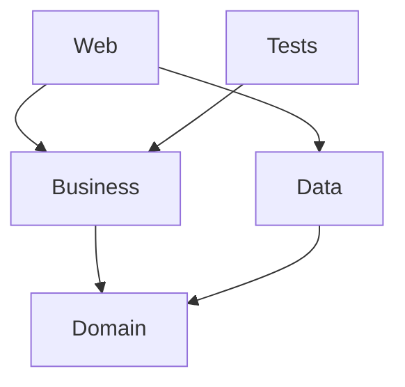

# Skill: dependency_graph_identification

Maps all project and package dependencies so migration order and risk are clear.

## Step 0 — Plan with sequential-thinking

Call `sequential-thinking` MCP with:
- Number of projects in the solution
- Goal (migration order? find breaking packages? circular deps?)

Use its output to decide the depth of analysis needed.

## Step 1 — Read the solution structure

Use `filesystem` MCP to read the `.sln` file:

```
1. Extract all project paths and GUIDs
2. Note project types from GUID:
   {FAE04EC0-...} = C# project
   {F184B08F-...} = VB.NET
   {349C5851-...} = Web Application
   {E24C65DC-...} = Web Site
```

For each `.csproj`, read:
- `<ProjectReference>` elements → inter-project edges
- `<PackageReference>` or `packages.config` → NuGet edges
- `<TargetFrameworkVersion>` or `<TargetFramework>` → current TFM

## Step 2 — Build the dependency graph

Construct an adjacency list:

```
ProjectA → [ProjectB, ProjectC]
ProjectB → [ProjectD]
ProjectC → [ProjectD, ProjectE]
ProjectD → []  ← leaf node (migrate first)
ProjectE → []  ← leaf node (migrate first)
```

Identify:
- **Leaf nodes** (no outgoing project refs) → migrate first
- **Root nodes** (nothing depends on them) → migrate last
- **Shared libraries** (many dependents) → highest risk, migrate carefully

## Step 3 — Detect circular references

Perform a DFS cycle check on the graph.

```
If cycle detected:
→ Report the exact cycle path: A → B → C → A
→ Suggest: extract shared interface/contract to a new library
→ Do NOT proceed with migration until cycle is broken
```

## Step 4 — Analyze NuGet compatibility

For every unique package + version found across all `packages.config` / `.csproj` files:

```
1. Use context7 MCP to check: does <package>@<version> support net8.0?
2. Classify each as:
   ✅ Compatible    — has net8.0 / netstandard2.x target
   ⚠️  Needs update — older version; newer version is compatible
   ❌ Incompatible  — no .NET 8 support; replacement needed
   🔴 Blocking      — incompatible AND no known replacement
```

Group results by project so the user can see risk per project.

## Step 5 — Produce outputs

### 5a. Dependency tree (text)
```
MySolution.sln
├── MyApp.Web          [net48] [root]
│   ├── MyApp.Business [net48]
│   │   └── MyApp.Domain [net48] [leaf ✓]
│   └── MyApp.Data     [net48]
│       └── MyApp.Domain [net48] [leaf ✓]
└── MyApp.Tests        [net48] [root]
    └── MyApp.Business [net48]
```

### 5b. Migration order list
```
Recommended migration sequence:
1. MyApp.Domain        (leaf, no blockers)
2. MyApp.Data          (depends only on Domain)
3. MyApp.Business      (depends on Domain)
4. MyApp.Tests         (update after Business)
5. MyApp.Web           (last — most System.Web usage)
```

### 5c. Package risk summary table
```
Package                  | Version | Projects | .NET 8 Status
-------------------------|---------|----------|----------------
Newtonsoft.Json          | 10.0.3  | 4        | ⚠️  update to 13.x
EntityFramework          | 6.4.4   | 2        | ❌ → EF Core 8
System.Web.Mvc           | 5.2.7   | 1        | 🔴 blocking (rewrite)
Dapper                   | 1.50.5  | 1        | ⚠️  update to 2.1.x
NLog                     | 4.7.15  | 3        | ⚠️  update to 5.x
```

### 5d. Mermaid diagram (optional, for documentation)


Output this if the user asks for a visual or diagram.

## Step 6 — Save the report

Write the analysis to `DEPENDENCY_REPORT.md` at the repo root.  
This file should be committed and referenced throughout the migration.

## Useful commands (run via shell tool)

```bash
# List all packages across solution
dotnet list <solution.sln> package

# Show full NuGet dependency tree
dotnet list <solution.sln> package --include-transitive

# Check for outdated packages
dotnet list <solution.sln> package --outdated

# Check for packages with known vulnerabilities
dotnet list <solution.sln> package --vulnerable

# Find all .csproj files
find . -name "*.csproj" -not -path "*/obj/*"

# Find all packages.config files (old-style)
find . -name "packages.config"

# Grep for project references
grep -rh "ProjectReference" --include="*.csproj" | sort -u

# Count System.Web usages (risk indicator)
grep -rl "System.Web" --include="*.cs" | wc -l